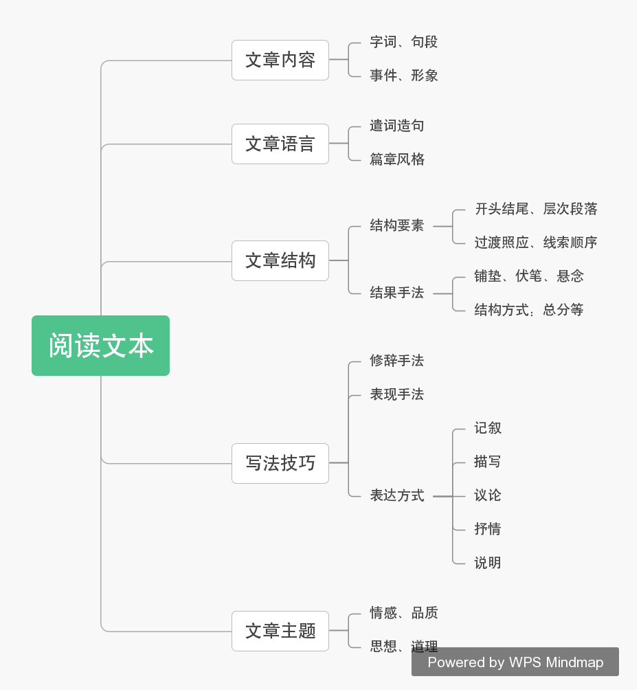

## 语文阅读
初中语文阅读题搜集、分析与整理。

## 阅读理解考查“五大板块”：

- 文章内容
- 文章语言
- 文章结构
- 写法技巧
- 文章主题

## 描写

### 题型

1. 第（X）段划线句子运用了什么描写方法，写出了什么？（2分）
2. 开头划线句子在文中起到了什么作用？（3分）
3. 文中划线部分描写了峡谷险峻气势，请分析其表现特色。（4分）

### 答题思路

1.第（X）段划线句子运用了什么描写方法，写出了什么？（2分）

**例题** 

> 老栓走到家，店面早经收拾干净，一排一排的茶桌，滑溜溜的发光。但是没有客人；只有小栓坐在里排的桌前吃饭，<u>大粒的汗，从额上滚下，夹袄也帖住了脊心吃个饭，居然汗透重衫，可见身体之弱，两块肩胛骨高高凸出，印成一个阳文的"八"字。</u>老栓见这样子，不免皱一皱展开的眉心。既心疼又厌恶。心疼的是儿子的病痛，厌恶的是儿子瘦弱的躯体。复杂的父亲情感。他的女人，从灶下急急走出，睁着眼睛，嘴唇有些发抖。 

**答题思路** 划线部分内容是外貌描写，外貌描写的作用是表现人的生活状况或身体状况。因此，我们需要解答出这一段反映了华小栓的身体状况：身体的虚弱。

**参考答案** 文章运用了人物的外貌描写，写出了华小栓身体的虚弱。

**简要评析** 答出“外貌描写”的1分，答出“身体的虚弱”的 1 分。